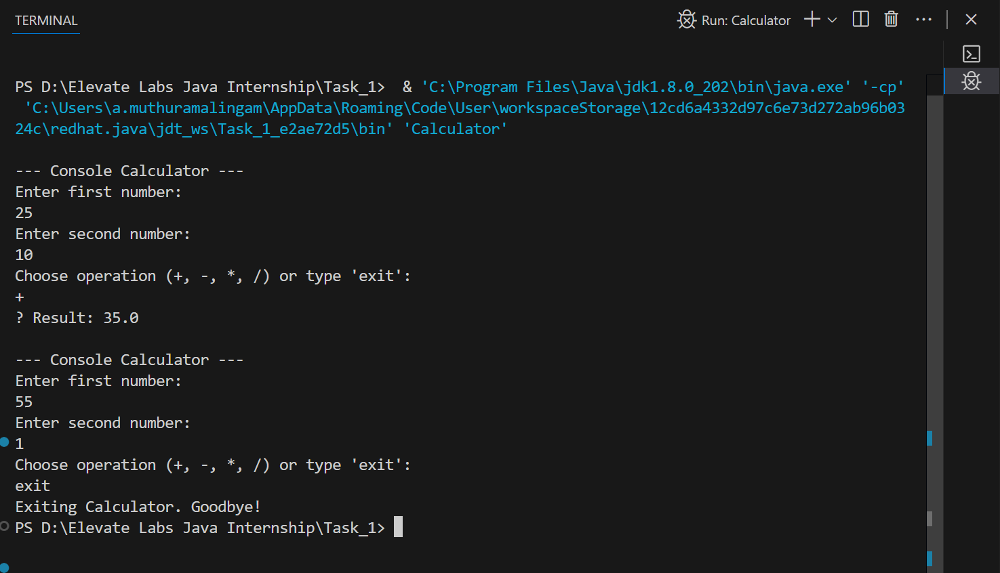

# 🧮 Java Console Calculator

## 📌 Description
This is a simple **console-based calculator** built using **Java**.  
It demonstrates the use of:
- Methods for addition, subtraction, multiplication, and division.
- `Scanner` class for user input.
- Loops to allow multiple calculations until the user exits.
- Conditionals (`if`, `switch`) for logic flow.

This task was given as part of my **Java Developer Internship**.

---

## 🚀 Features
- Addition, Subtraction, Multiplication, Division
- Handles divide-by-zero safely
- Runs continuously until user types `exit`
- Easy to understand Java code with methods

---

## 🛠 Tools & Technologies
- Java (JDK 17 or later)
- VS Code / IntelliJ CE
- Command Prompt / Terminal

--- Console Calculator ---

Enter first number: 
10
Enter second number: 
5
Choose operation (+, -, *, /) or type 'exit': 
*
✅ Result: 50.0

Choose operation (+, -, *, /) or type 'exit': 
exit
Exiting Calculator. Goodbye!

📖 Key Concepts Learned
OOP (Object-Oriented Programming) basics
Methods for modular code
Conditionals for decision making
Loops for repeated execution
I/O handling with Scanner

📂 Deliverables
Calculator.java → Main source code
README.md → Project documentation

Outputs:

